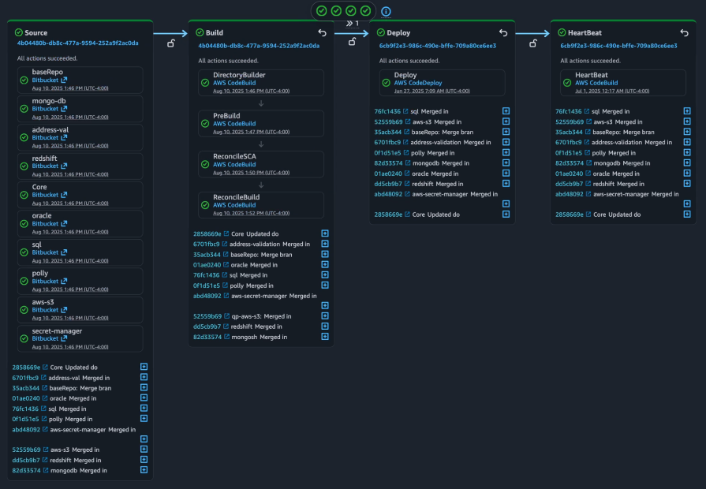

# AWS multi-repo CI/CD for .NET 8 -> IIS on EC2

This repository contains a scaffold for a Bitbucket multi-repo CI/CD pipeline that builds a .NET 8 Web API and deploys it to IIS on Windows EC2 instances using CodePipeline, CodeBuild, CodeDeploy and CodeStar Connections.



Purpose
- Provide an opinionated, Copilot-ready scaffold that demonstrates how to wire multiple Bitbucket repos (pipeline + app + dependencies) into a single AWS CodePipeline.
- Show a working example of build (CodeBuild on Windows), Ansible prep steps, and CodeDeploy deployment to Windows/IIS using appspec + PowerShell hooks.

Repository layout (top-level folders)
- `baseRepo` – pipeline and infrastructure artifacts (CloudFormation template, Terraform scaffold, buildspec, Ansible playbooks, CodeDeploy appspec and PowerShell hooks). Use this as the pipeline repo.
- `Core` – minimal .NET 8 Web API (health endpoint), unit tests and a GitHub Actions workflow used for local validation.
- dependency placeholders – `mongo-db`, `address-val`, `redshift`, `oracle`, `sql`, `polly`, `aws-s3`, `secret-manager` (these are example dependency repos shown as separate Bitbucket repositories in the pipeline).

Quick start — CloudFormation (fast)
1. Edit `baseRepo/infrastructure/cloudformation-parameters.json` and set:
   - `BitbucketWorkspace` to your Bitbucket workspace/team
   - `CodeStarConnectionArn` (or leave blank if you'll create connection separately)
   - confirm `PipelineRepoName` (`baseRepo`) and `AppRepoName` (`Core`) or change to your naming
   - set `DepRepoNames` (comma-separated) as needed; the template supports up to 8 dependency slots.

2. Deploy using the included PowerShell wrapper (from the repo root):

```powershell
cd .\baseRepo\infrastructure
.\deploy-stack.ps1 -Profile <aws-profile> -Region <aws-region>
```

Notes:
- After the stack creates the CodeStar Connection resource you must approve it in the AWS Console (CodeStar Connections) for Bitbucket access.
- The CloudFormation template uses a fixed maximum of 8 dependency source slots via parameterized/conditional actions. For truly dynamic repo counts, prefer the Terraform scaffold in `baseRepo/infrastructure/terraform` or generate the pipeline with CDK.

Quick start — Terraform (more flexible)
- Path: `baseRepo/infrastructure/terraform`
- Before running, populate a `terraform.tfvars` or pass variables on the CLI. Example run:

```powershell
cd .\baseRepo\infrastructure\terraform
terraform init
terraform plan -var="artifact_bucket_name=<your-unique-bucket>" -var="bitbucket_workspace=<your-workspace>" -var="codedeploy_application_name=<app>" -var="codedeploy_deployment_group_name=<dg>"
```

Caveats & next steps
- The Terraform scaffold was recently refactored to fix HCL schema issues — run `terraform plan` to validate in your account. The `aws_codestarconnections_connection` resource still requires manual approval in the AWS Console after creation.
- The included CodeBuild project uses a Windows CodeBuild image and acts as both Build and (placeholder) Prep project; consider splitting into two projects if Prep needs different runtimes.
- IAM policies are intentionally permissive in the scaffold; before production usage, tighten to least privilege.

Where to look next
- Pipeline CloudFormation: `baseRepo/infrastructure/codepipeline-cloudformation.yml`
- CloudFormation deploy helper: `baseRepo/infrastructure/deploy-stack.ps1` and `baseRepo/infrastructure/cloudformation-parameters.json`
- Terraform: `baseRepo/infrastructure/terraform/main.tf`, `variables.tf` (updated), `outputs.tf`
- App (example): `Core/`

If you want, I can:
- produce a `terraform.tfvars.example` from the CloudFormation parameters file,
- update S3 resource to remove provider deprecation warnings,
- or run a dry `terraform plan` locally and paste the output here (I cannot run Terraform in your environment without your approval).
